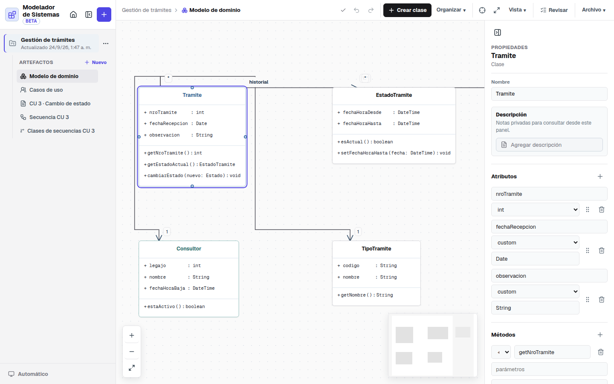
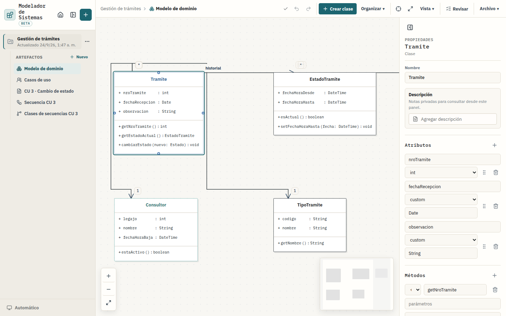
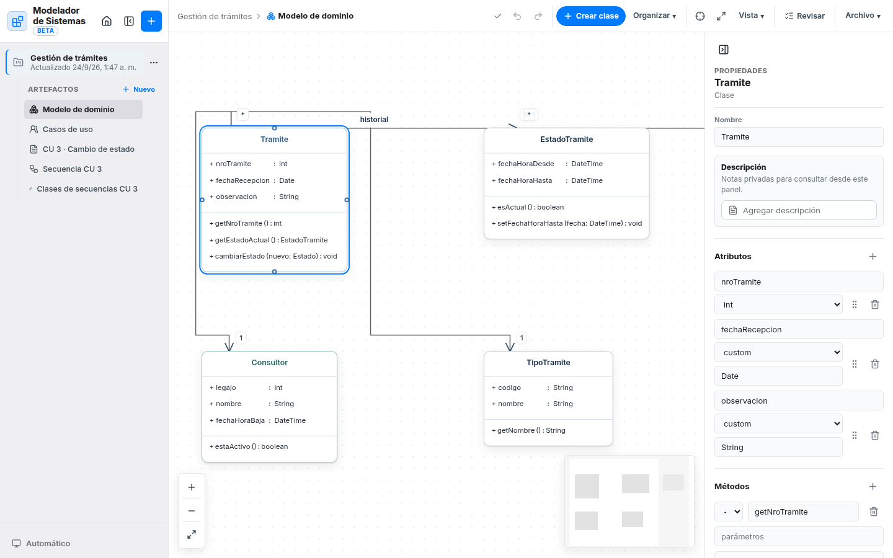

# Modelador de Sistemas 2.0 — registro del rediseño

Rama `rediseno-v2`, creada desde `main` (1fd1d30). Nada de esto llega a `main`
sin aprobación explícita.

> Nota: la etiqueta `v1.0.0` apunta a 6185434, anterior al modo oscuro, al
> arreglo de notas de secuencia, a la propagación de renombres y a la limpieza
> de etiquetas de asociaciones. `main` ya los incluye, y la 2.0 parte de ahí.

## 1. Preparación: la 2.0 convive con la v1

| | v1 (actual) | 2.0 |
|---|---|---|
| Nombre | Modelador de Sistemas | Modelador de Sistemas 2.0 |
| Bundle id | `com.alejocarabelli.disenosistemas` | `com.alejocarabelli.disenosistemas.v2` |
| Ejecutable | `DisenoDeSistemas` | `ModeladorV2` |
| Instalación | `/Applications/Modelador de Sistemas.app` | `/Applications/Modelador de Sistemas 2.0.app` |
| Esquema web (origen del almacenamiento) | `disenosistemas://app` | `modeladorv2://app` |
| Respaldos | `~/Documents/Modelador de Sistemas/Respaldos` | `~/Documents/Modelador de Sistemas 2.0/Respaldos` |
| Carpeta de compilación | `/private/tmp/diseno-sistemas-macos-build` | `/private/tmp/modelador-sistemas-v2-build` |

**Por qué la 2.0 no ve tus proyectos:** WebKit guarda el almacenamiento local
por aplicación (bundle id) y, dentro de ella, por origen (esquema). La 2.0
cambia las dos cosas. Las claves y el formato del almacenamiento son los mismos
que en la v1, así que un JSON exportado de una se importa en la otra.

**El script nunca toca la v1:** solo borra y reemplaza
`/Applications/Modelador de Sistemas 2.0.app`. Con `SKIP_INSTALL=1`
compila sin instalar.

**Sin etiqueta Beta:** a pedido, la 2.0 se trabaja como producto final. El
nombre visible es "Modelador de Sistemas 2.0" (app, ventana, menú, respaldos) y
la interfaz no muestra ninguna etiqueta de versión preliminar.

**Compilación en GitHub:** `.github/workflows/macos-v2.yml` compila en un Mac
de GitHub Actions en cada push a `rediseno-v2` (el `.dmg` y el `.zip` quedan como
artefacto de la ejecución). Al subir una etiqueta `v2.*` además los publica en
una release (pre-release si la etiqueta lleva sufijo, como `v2.0.0-rc.1`).

## 2. Diagnóstico de la v1

Recorrido completo en el navegador (capturas en `docs/rediseno-v2/v1-*.png`) y
en el código. Lo que encontré:

**Cada editor arma su barra a su manera.** La acción principal es un botón en
clases ("Crear clase") y secuencia ("Mensaje"), un menú en casos de uso
("Agregar elemento") y no existe en el flujo. "Revisar" es un botón resaltado
en clases, un icono con texto en secuencia, una acción secundaria en el flujo y
no está en casos de uso. El menú de vista se llama "Vista" en tres editores y
"Opciones de vista y referencias" en secuencia, donde además mezcla vista con
referencias a otros artefactos.

**Controles duplicados:**
- Zoom y encuadre en la barra ("Centrar vista", "Ver todo") y otra vez en el
  lienzo ("Acercar", "Alejar", "Ajustar a la vista"). "Ver todo" y "Ajustar a
  la vista" hacen lo mismo.
- Secuencia: "Insertar mensaje" en la barra y un "+" con la misma acción en el
  panel de estructura. "Ocultar panel de estructura" en la barra y "Ocultar
  estructura" en el propio panel.
- "Exportar JSON" e "Importar JSON" en el menú Archivo de los cinco editores,
  aunque exportan e importan el **proyecto entero**, no el diagrama. Importar
  también está en el inicio.
- Clases de secuencias: una segunda fila de barra con cuatro controles de
  sincronización (contador, fuente del modelo, importar, actualizar vínculos,
  abrir secuencia) debajo de la barra normal.

**Tipografía sin escala.** En la misma tarjeta o diálogo conviven 11, 13 y 17 px
(los botones heredan 16-17 px, las etiquetas usan 11 px). El nombre de la app
ocupa tres líneas en la barra lateral.

**Detalles:** el minimapa se muestra como un recuadro vacío en un diagrama sin
elementos; "Desplegar" aparece deshabilitado todo el tiempo en el flujo; los
atajos del flujo viven en un menú propio y los de secuencia solo se descubren
por el título de un botón.

**Lo que funciona y se conserva:** el lienzo y el render UML, el inspector
contextual, los estados vacíos con acción directa, el modo teclado de
secuencia, la revisión semántica, los respaldos y el modo oscuro.

### Decisiones

1. **Una sola barra de editor, con zonas fijas** en los cinco editores:
   `Proyecto › Artefacto · estado de guardado` · `Deshacer Rehacer` ·
   `acción principal + herramientas de inserción` · `Revisar` · `Vista ▾` ·
   `Exportar ▾`. Mismo componente, mismo orden, mismos iconos.
2. **"Archivo" pasa a llamarse "Exportar"** y solo contiene los formatos del
   artefacto (PNG, PDF, Word). Exportar/Importar proyecto van al menú del
   proyecto y al inicio.
3. **Zoom y encuadre solo en el lienzo**, con el mismo control flotante en
   clases, casos de uso, clases de secuencias y secuencia.
4. **"Vista" reúne todo lo que cambia cómo se ve** (grilla, minimapa, atributos,
   activaciones, numeración, plegar pasos). Las referencias de secuencia se
   separan en su propia sección.
5. **Un solo panel de atajos** para toda la app (tecla `?` o botón en la barra
   lateral) en lugar del menú "Atajos" del flujo.
6. **Clases de secuencias integra la sincronización en un menú** "Sincronizar"
   dentro de la barra única.
7. **Escala tipográfica cerrada** y tipografías empaquetadas en la app.

## 3. Dirección visual

Exploré tres direcciones sobre la misma pantalla real (modelo de dominio del
proyecto de ejemplo, con una clase seleccionada y el inspector abierto):

| | |
|---|---|
| **A · Grafito** — monocroma, Geist, acento índigo, botón principal negro. |  |
| **B · Cuaderno técnico** — papel, tinta y petróleo; IBM Plex Sans y Plex Mono. |  |
| **C · Nativo macOS** — barra lateral traslúcida, azul del sistema, radios grandes. |  |

**Elegida: B, Cuaderno técnico**, con la limpieza de chrome de A.

- **Es la única con identidad propia.** A y C se ven bien pero podrían ser
  cualquier herramienta. B se parece a lo que la app produce: UML en papel.
- **Las clases con borde de tinta se leen como UML impreso**, y así se ven igual
  en pantalla y en el PDF que se entrega.
- **Plex Mono alinea atributos y métodos**: `+ fechaRecepcion : Date` se lee como
  código, que es lo que es.
- **El petróleo es calmo para sesiones largas** y no compite con los colores de
  grupo de las clases ni con los de los participantes de secuencia.
- **Tiene un modo oscuro natural**: pizarra con tinta clara, no un gris
  invertido.

Plex Sans y Plex Mono se empaquetan con la app (funciona sin conexión), así que
se ven igual en todas las Mac y en las exportaciones.

## 4. Sistema

Definido en `DESIGN.md` (tokens, componentes y contratos). Los componentes
compartidos viven en `src/components/ui/` y sus estilos en `src/design/`.

## 5. Cambios por pantalla

Cada fila dice dónde estaba el control en la v1, qué pasó y por qué.

### 5.1 Inicio y barra lateral

| Control (v1) | Dónde estaba | Ahora | Por qué |
|---|---|---|---|
| Barra lateral | Oculta en el inicio | Siempre visible, también en el inicio, con "Inicio" como primer ítem | La app se siente una sola: se navega igual desde cualquier pantalla |
| Contraer/expandir barra lateral | Botón en el encabezado de la barra | Botón en el pie de la barra + atajo **⌘\\** (nuevo) | El encabezado queda para el nombre, que ahora entra en una línea |
| Ir al inicio (icono casa) | Encabezado de la barra | Ítem "Inicio" arriba de la lista de proyectos | Es navegación, no una herramienta |
| Crear proyecto (+) | Encabezado de la barra | "+" junto al título "Proyectos" | Queda al lado de lo que crea |
| Contraer al abrir un artefacto | Automático | Se respeta lo que elegiste | La barra es la navegación entre artefactos; esconderla sola obligaba a volver a abrirla |
| "+ Nuevo" artefacto | Encabezado de la lista de artefactos | Última fila de la lista: "+ Nuevo artefacto" | Se lee en el lugar donde aparecerá el nuevo |
| Menú de proyecto | Renombrar, Eliminar | Renombrar…, **Exportar proyecto (JSON)**, separador, Eliminar proyecto… | Exportar el proyecto sale de los editores (ver 5.2–5.6) y llega a su lugar |
| Selector de tema | Pie de la barra y encabezado del inicio | Solo en el pie de la barra | Estaba duplicado |
| Atajos de teclado | Menú "Atajos" solo en el flujo | Panel único para toda la app: botón en el pie de la barra y tecla **?** (nueva) | Todos los atajos en un lugar, descubribles desde cualquier pantalla |
| Contador, búsqueda, Importar, Nuevo proyecto (inicio) | Encabezado del inicio | Igual, en una sola fila; la búsqueda también encuentra artefactos por nombre | — |
| "Ordenados por última edición" | Texto en el inicio | Quitado; el orden se anuncia al lector de pantalla en la lista | Era un rótulo sin acción |
| Lista de proyectos | Filas | Tarjetas tipo cuaderno con iniciales, tipos de artefacto y fecha | Más fácil de reconocer de un vistazo |
| Inicio sin proyectos | "Todavía no hay proyectos" + botón | Bienvenida con Nuevo proyecto, Importar proyecto… y los cinco tipos de artefacto | Es la primera pantalla que ve alguien nuevo |
| Resumen del proyecto | "1 clase" para un diagrama de clases | "1 diagrama de clases" | Era un error de texto |
| Iconos de tipo de artefacto | Distintos en inicio y barra lateral | Un solo juego para toda la app | Coherencia |

### 5.2 Diagrama de clases

| Control (v1) | Dónde estaba | Ahora | Por qué |
|---|---|---|---|
| Barra de herramientas | Propia del editor | `EditorToolbar` compartida: migas · guardado · deshacer/rehacer · **Clase** · Organizar · Revisar · Vista · Exportar | Mismo orden y mismos controles en todos los editores |
| "Crear clase" | Botón principal | Botón principal "**Clase**" (el título dice "Crear clase (o doble clic en el lienzo)") | La etiqueta corta entra siempre; el verbo lo da el botón |
| Centrar vista | Icono en la barra | **Quitado** | "Ajustar a la vista" hace lo mismo y además encuadra; tener los dos confundía |
| Ver todo | Icono en la barra | Quitado de la barra; es "Ajustar a la vista" (⤢) en el control de zoom del lienzo | Era un duplicado exacto |
| Acercar, alejar, ajustar | Columna de botones en el lienzo | Control de zoom compartido abajo a la izquierda: − **porcentaje** + · ⤢. Clic en el porcentaje vuelve al 100 % (nuevo) | Mismo control en todos los lienzos; ahora se ve el zoom actual |
| Organizar | Menú de texto | Menú con icono; los ítems de alinear/distribuir tienen iconos y se habilitan según la selección, con un rótulo que dice qué hace falta | Se entiende por qué un ítem está deshabilitado |
| Ayuda "Mayús + arrastrar…" | Texto dentro de Organizar | Panel de atajos (tecla ?) | Los atajos viven en un solo lugar |
| Vista → mostrar/ocultar atributos, métodos, colores de grupo | Botones que cambiaban de texto ("Ocultar…/Mostrar…") | Casillas con tilde (Atributos, Métodos, Colores de grupo) | Se ve el estado sin leer el verbo |
| Vista → grilla, ajustar a la grilla, minimapa | Botones con icono | Casillas con tilde en la sección "Lienzo" | Igual que arriba |
| Archivo → Exportar PNG / PDF | Menú "Archivo" | Menú "**Exportar**": Imagen PNG, Documento PDF | El menú solo exporta el diagrama |
| Archivo → Exportar JSON / Importar JSON | Menú "Archivo" | Menú del proyecto en la barra lateral (Exportar proyecto) e inicio (Importar) | Exportaban e importaban el proyecto entero, no este diagrama |
| Tipo de atributo (inspector) | Select con opción "custom" que abría un segundo campo | Un campo con sugerencias (`int`, `string`, `date`…) donde también se escribe cualquier tipo | Misma capacidad, un solo control, sin la palabra en inglés |
| Atributos y métodos (inspector) | Campos apilados | Filas tipo código: `⠿ nombre : tipo 🗑` y `+ nombre 🗑 / ( parámetros ) : retorno` | Se leen como la clase del lienzo |
| Miembros en las clases del lienzo | Plex Sans | Plex Mono | Nombres, `:` y tipos quedan en columnas; se lee como código |

### 5.3 Diagrama de secuencia

| Control (v1) | Dónde estaba | Ahora | Por qué |
|---|---|---|---|
| Barra de herramientas | Propia, con grupos y reglas de ancho especiales | `EditorToolbar` compartida: **Mensaje** · Participante · Fragmento ▾ · Nota · Plantillas · Modo teclado · Revisar · Vista · Exportar | Misma forma que los otros editores |
| Plantillas educativas | Menú "Archivo" | Botón "Plantillas" en la zona de agregar | Cargar una plantilla es agregar contenido, no un archivo |
| Fragmento ▾ | Lista "alt · caminos alternativos" | Mismo contenido; el operador en mono y color de acento, alineado | Se leen como las palabras clave de UML que son |
| Modo teclado | Botón "Teclado" con tecla `M` visible | Botón con icono en la zona de agregar; el atajo `M` está en el título y en el panel de atajos | Menos texto en la barra; el atajo sigue a la vista |
| Ocultar/mostrar estructura | Icono en la barra **y** botón en el panel | Casilla "Estructura" en Vista ▸ Paneles y el botón del propio panel | Era un duplicado |
| "+" Agregar mensaje en el panel de estructura | Encabezado del panel | **Quitado** | Duplicaba "Mensaje" de la barra (y el doble clic en el lienzo) |
| Opciones de vista y referencias | Menú "Vista" con casillas y selects mezclados | Vista ▾ con secciones: Paneles (Estructura), Diagrama (Activaciones, Colores de participantes, Numeración) y Referencias (Diagrama de clases, Flujo de sucesos) | Cada cosa en su sección; las referencias quedan separadas de lo visual |
| Colores de participantes | Select Automáticos/Desactivados | Casilla | Solo tenía dos estados |
| Numeración | Select "Correlativa / Jerárquica / Sin números" | Igual, con ejemplo: "Correlativa (1, 2, 3)", "Jerárquica (1, 1.1, 1.2)" | Se entiende sin probar |
| Exportar PNG o PDF… | Menú "Archivo" | Menú "Exportar" | Igual que en los otros editores |
| Exportar/Importar JSON | Menú "Archivo" | Proyecto (barra lateral) e inicio | Eran acciones del proyecto |
| Zoom | Barra propia abajo (− 100% + enfocar) | Control de zoom compartido, mismo lugar y mismos nombres que en los otros lienzos | Coherencia |
| Barra de selección múltiple | Flotando dentro de la barra | Franja contextual debajo de la barra, en color de selección | Aparece donde se lee y no desordena la barra |

### 5.4 Flujo de sucesos

| Control (v1) | Dónde estaba | Ahora | Por qué |
|---|---|---|---|
| Barra de herramientas | Propia, sin acción principal | `EditorToolbar`: **Camino alternativo** · Revisar · Vista · Exportar | Misma forma que el resto; la acción de documento más frecuente queda a la vista aunque se haya bajado por la página |
| "Agregar camino" | Encabezado de "Caminos alternativos" | Botón principal de la barra; si no hay caminos, también en el estado vacío de la sección | Evita el duplicado y el estado vacío dice qué hacer |
| "Agregar fila" / "Agregar primera fila" | Debajo de cada tabla | Igual | Agrega a esa tabla en particular (camino básico o un alternativo) |
| Plegar pasos largos / Desplegar | Dos botones en la barra; "Desplegar" siempre visible aunque no hubiera nada plegado | Menú Vista: "Plegar pasos largos", "Desplegar todos los pasos" (se habilita cuando hay algo plegado) | Cambian cómo se ve el documento; no son acciones frecuentes |
| Atajos | Menú "Atajos" propio | Panel de atajos de toda la app (tecla ? o barra lateral), sección "Flujo de sucesos" | Todos los atajos en un lugar |
| Revisar el flujo | Botón secundario | `ReviewButton`, igual que en los otros editores | Coherencia |
| Archivo → Exportar PDF / Word | Menú "Archivo" | Menú Exportar: Documento PDF, Documento Word (.docx). Mismos exportadores, mismo formato de tablas | Solo exporta este documento |
| Archivo → Exportar/Importar JSON | Menú "Archivo" | Proyecto (barra lateral) e inicio | Eran acciones del proyecto |
| Encabezados de tabla | Texto pequeño | Mono en mayúsculas, como los rótulos del resto de la app | Coherencia |
